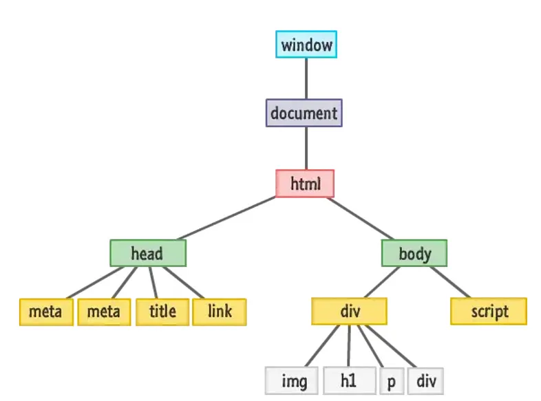
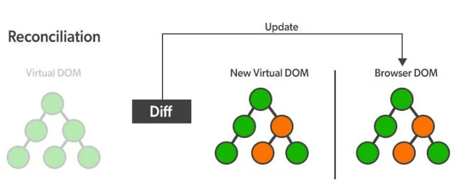

# What-is-vDOM ?
> If you are an __English speaker__, see the [this site](https://medium.com/@BharathkumarV/reacts-virtual-dom-17fdcb290a10) to understand **what is vdom?**, but if you are a __Persian speaker__, I will help you :)
---
### اگر شما هم در زمینه برنامه نویسی __فرانت اند__ یا __بک اند__ فعالیت دارید قطعا نام __`دام مجازی`__ یا  __`Virtual DOM`__ به گوشتان خورده است.
#### پیشناهاد میکنم اگر راجب __`دام`__ یا __`DOM`__ نمیدانید  قبل از مطالعه این مقاله، [این مقاله](https://developer.mozilla.org/en-US/docs/Web/API/Document_Object_Model/Introduction) را مطالعه کنید.

بریم سراغ اصل مطلب ، در اینجا من خیلی خلاصه و ساده توضیح خواهم داد که:
 > دام مجازی چیست؟

 > چه قابلیتی را به __React__ افزوده است؟

## دام مجازی چیست؟
> دام واقعی یا دام اصلی یا Real DOM

#### اگر با __DOM__ آشنا باشید میدانید که __DOM__ شامل تمام داده ها و ساختار یک صفحه وب است. در تصویر زیر شما ساختار درختی __DOM__ را مشاهده می کنید:

#### در __JS__ ما برای اینکه بخواهیم تغییری در صفحه وب ایجاد کنیم `(برای مثال تغییر محتوای یک المنت)` باید کل دام را تغییر دهیم. و بدیهی است که این امر از ما زمان زیادی میگیرد و در پروژه های بزرگ و پیچیده که اطلاعات زیادی در دام موجود است، این کار با صرف زمان زیادی همراه است که موجب کاهش بهره وری سایت میشود.
> اما اینجا React به کمک ما می آید...!

#### در کتابخانه React ما علاوه بر دام اصلی یا Real DOM  دام مجازی یا Virtual DOM را هم داریم.  که در بروزرسانی  صفحه وب به ما کمک می کند.
> اما چگونه؟

#### هرگاه ما تغییری در صفحه وب ایجاد میکنیم React سراغ تغییر دادن دام اصلی نمی رود بلکه از روی دام مجازی کپی میگیرد و دام مجازی جدیدی را ایجاد میکند. سپس دام مجازی جدید را با دام مجازی قدیمی مقایسه میکند و هرکجا تغییری ایجاد شده باشد را تشخیص میدهد. سپس تغییر ایجاد شده را به دام اصلی وارد میکند میکند.
> دقت کنید که هنگام بروزرسانی دام اصلی فقط بخش مورد نظر بروز میشود و نه کل دام!

#### برای درک بهتر موضوع، عکس زیر را مشاهده کنید:

## دام مجازی چه قابلیتی را به __React__ افزوده است؟

> افزایش سرعت
#### این قابلیت به ما این امکان را میدهد سریع تر صفحه خود را بروزرسانی کنیم بدون اینکه نیاز به تغییر کل دام و اتلاف وقت باشد.

> استفاده سریع تر و راحت تر از API
#### وقتی که ما بتوانیم سریع تر صفحه خود را تغییر دهیم مشخصا به سادگی میتوانیم داده های جدید را از API بگیریم و وارد دام خود کنیم

> اجرای و پرفورمنس بهتر
#### طبیعی است سایتی که سرعت بالاتری داشته باشد پرفورمنس و کارایی بهتری هم خواهد داشت و چه کسی هست که نخواهد سایت خود را با بالاترین کارایی در اختیار کاربران قرار دهد؟

## کلام آخر

#### در کل تغییر دادن کل دام برای اعمال یک تغییر کوچک به صرفه نیست و دام مجازی قابلیت این را ایجاد میکند که از این اقدام نامناسب جلوگیری کنیم.

##### امیدوارم این مقاله کوچک توانسته باشد شمارا به شناخت کافی از دام مجازی رسانده باشد هرچند که در اینجا خلاصه وار به تفهیم دام مجازی پرداختم. ممنون که تا آخر مقاله همراه من بودید. بدرود :)
